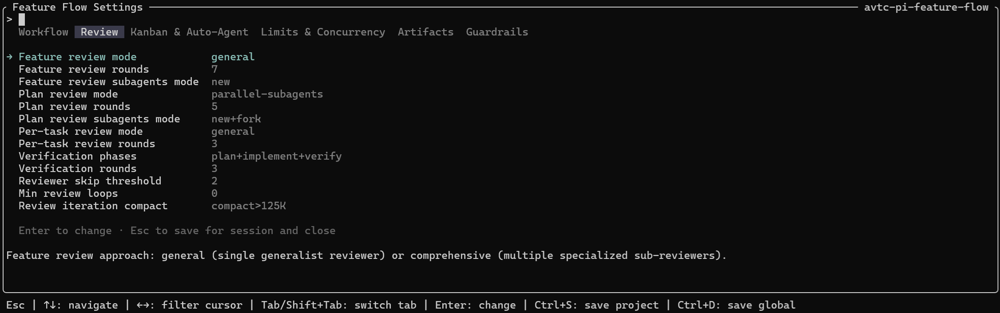
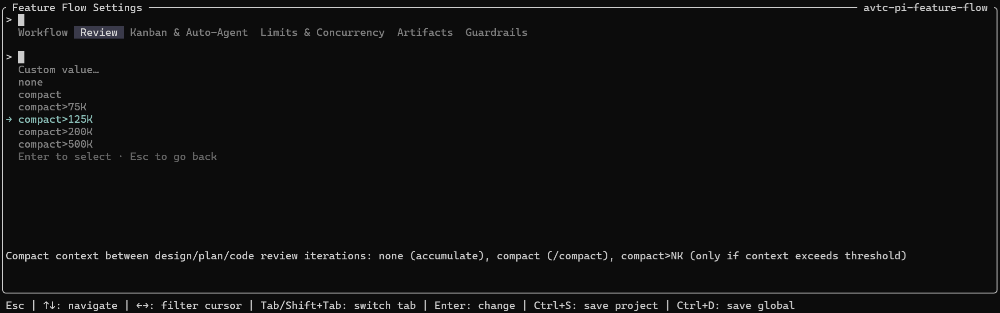

# avtc-pi-settings-ui

A schema-driven settings UI for pi extensions — define your settings, get a tabbed modal, a /<name>:settings command, and layered persistence.

## Features

- **Schema-driven UI** — define settings once in a typed schema; the library renders the full modal automatically
- **Tabbed layout** — group settings into tabs; each tab renders as a separate panel
- **Typed setting items** — 7 built-in types (`string`, `number`, `duration`, `compact-threshold`, `boolean`, `model`, `thinking-level`) with presets, optional `min`/`max` bounds, and custom type support
- **Filter-first UI** — type to filter every list by substring (over label + value); `Tab`/`Shift+Tab` switch tabs, `Enter` opens the value picker
- **Layered persistence** — choose any combination of three storage levels via `storageLevels` (`session`, `project`, `global`); see [Persistence & session lifecycle](#persistence--session-lifecycle)
- **Atomic writes** — settings are saved atomically to prevent corruption
- **Value normalization** — every value is validated against the schema before it's saved
- **Environment variable propagation** — settings can be propagated to child processes via env vars (e.g. for subagents)

The rendered modal — tabbed panels, filter-first lists, and per-type value pickers:





## Installation

Add it as a dependency of your extension:

```bash
npm install avtc-pi-settings-ui
```

### Dialog coordination (optional)

The settings modal queues behind other open dialogs (instead of stealing keyboard focus) via [`avtc-pi-ui-components`](https://github.com/avtc/avtc-pi-ui-components)'s dialog coordinator. If you want that coordination, also install ui-components and load it as a companion extension:

```jsonc
// your package.json
{
  "dependencies": {
    "avtc-pi-settings-ui": "^1.0.0",
    "avtc-pi-ui-components": "^1.0.0"
  },
  "pi": {
    "extensions": [
      "./index.ts",
      "node_modules/avtc-pi-ui-components/index.ts"
    ],
    "allowedCodeDeps": ["avtc-pi-settings-ui"]  // ui-components is loaded, not imported
  }
}
```

Without ui-components the settings modal still works — it just opens immediately rather than queuing.

## Public API

| Export | Purpose |
|---|---|
| `registerSettingsCommand(pi, schema, opts)` | Register the `/<name>:settings` command + modal; returns the settings handle you read from at runtime |
| `settingsFilePaths(name)` | Global + project file paths for `<name>`'s settings — `~/.pi/agent/<name>-settings.json` and `<cwd>/.pi/<name>-settings.json` (spread into the schema) |
| `SettingSchema`, `SettingsSchema` | Define your settings and tabs |
| `StorageLevel`, `SettingsHandle`, `RegisterSettingsOptions` | Types: storage levels (`session`/`project`/`global`), the returned handle, the options bag |
| `PresetsSource`, `PresetPair`, `PresetElement`, `PresetValue` | Author `presets`: full pairs or bare values (string/number/boolean/null) |
| `registerTypeDefinition`, `TypeDefinition`, `TypeContext` | Register custom types (7 built-ins ship pre-registered) |
| `formatHumanDuration` | Human form of a duration |

## Usage

```ts
import { registerSettingsCommand, SettingsSchema, settingsFilePaths } from "avtc-pi-settings-ui";

const schema: SettingsSchema = {
  settings: [
    {
      id: "mySetting",
      label: "My Setting",
      description: "Controls something important",
      type: "string",
      defaultValue: "default",
      presets: [
        ["Default", "default"],
        ["Alternative", "alternative"],
      ],
    },
  ],
  tabs: [{ label: "General", settingIds: ["mySetting"] }],
  ...settingsFilePaths("my-extension"),
};

const settings = registerSettingsCommand(pi, schema, {
  commandName: "my-extension:settings",
  title: "My Extension Settings",
  titleRight: "avtc-pi-my-extension",
  storageLevels: ["session", "project", "global"],
  envVar: "PI_SETTINGS_MY_EXT",
});

settings.getSettings();
```

## Setting types

Every setting has a `type` resolved through a first-class `TypeDefinition` registry. Seven built-ins ship out of the box:

| Type | Stored value | Notes |
|------|-------------|-------|
| `string` | `string` | Text; closed enums via presets (`["a", "b"]`) |
| `number` | `number` \| `null` | Optional `min`/`max` bounds; `null` (unbounded/off) via a null preset |
| `duration` | `number` \| `null` | Human-readable (`5m`, `1h`, `30s`, `14d`); stored as milliseconds. `null` = unbounded/off, via a null preset |
| `compact-threshold` | `string` | Compact-context thresholds (`none`, `compact`, `compact>75K`, …) |
| `boolean` | `boolean` | `true`/`false`; presets `[true, false]` |
| `model` | `string` \| `null` | Model id (`provider/id`); presets generated from the available models. Nullable via a `["Default", null]` preset |
| `thinking-level` | `string` | Thinking level (label equals value) |

A `presets` array can hold full `[label, value]` pairs or bare values (`"a"`, `5`, `true`, `null`); a bare value pairs with itself, except a duration string which parses to milliseconds.

**Custom types:** register your own via `registerTypeDefinition(def)` and reference it as `type: "<def.id>"`. A `TypeDefinition` declares how values parse/format and optional `presets`; null support comes from including a null-valued preset (e.g. `["Off", null]`).

## Persistence & session lifecycle

Choose your storage levels via `storageLevels` on `registerSettingsCommand` (default: all three):

- **`session`** — in-memory only; survives `/reload` (same process) but not a full restart or new terminal. When `session` is included, settings are also propagated to subagents via the env var.
- **`project`** — `<cwd>/.pi/<name>-settings.json`. Survives across processes in that project.
- **`global`** — `~/.pi/agent/<name>-settings.json`. Survives everywhere.

**How edits save:** with a single file level (`global` or `project`), each edit writes straight to that file, so every pi instance reads the same on-disk truth. With multiple levels (or `session`), edits are held as a draft until you press a save key — `Ctrl+S` saves project, `Ctrl+D` saves global (each only when its level is enabled).

> Developed with [Z.ai](https://z.ai/subscribe?ic=N5IV4LLOOV) — get 10% off your subscription via this referral link.

## License

MIT
